# pystaple vs MATLAB STAPLE: validation figures

Generated by `tools/plot_comparison.py` on 2026-09-25 for 7 datasets (`hip_model.m`: pelvis, right femur and tibia, auto2020 joints, 64 kg).

## OpenSim model

* Structural differences (bodies, joints, coordinates, frames, markers, mesh files): **0**.
* Largest position difference: **1.0e-07 mm**, largest angle difference: **9.5e-10 rad**. Masses and inertias are bit-identical.

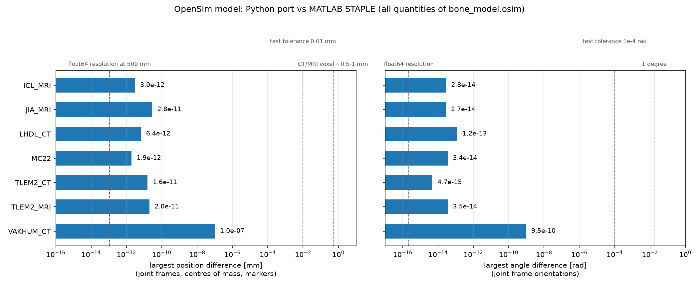

The differences are rounding noise: many orders of magnitude below the resolution of the medical images the bones come from, and close to the resolution of double-precision numbers.

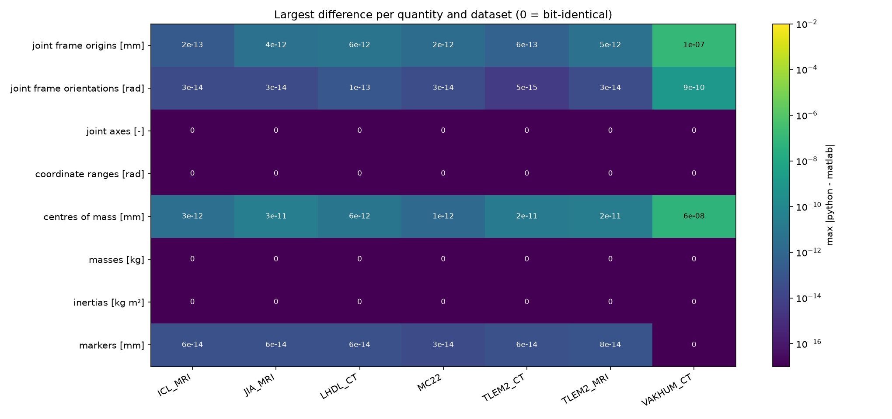

## Visualization geometries

MATLAB reduces the bone meshes with `reducepatch`, pystaple with `fast-simplification`, both to 30 % of the triangles. The meshes are only used for display (they do not affect the model), so the relevant question is how faithfully each one represents the original bone.

* The Python mesh is at least as faithful as MATLAB's (mean distance) for **19 of 21** bones.

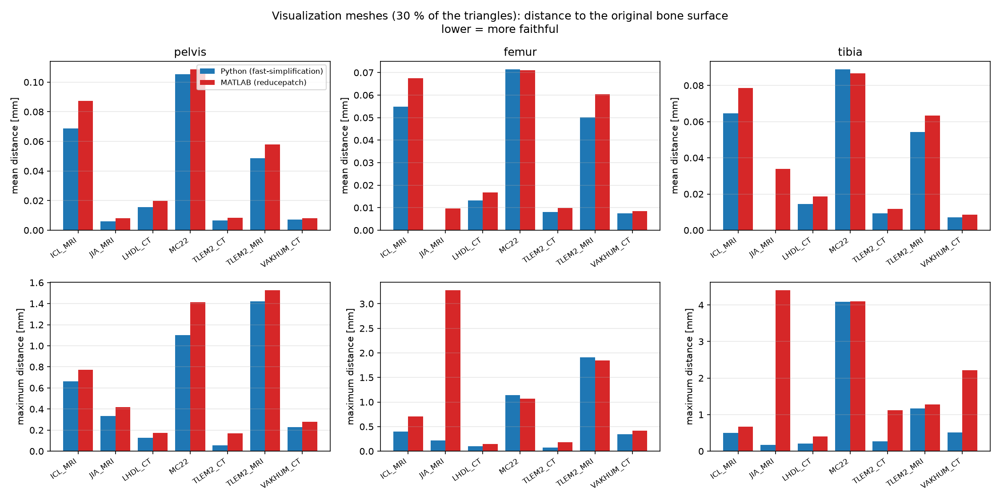

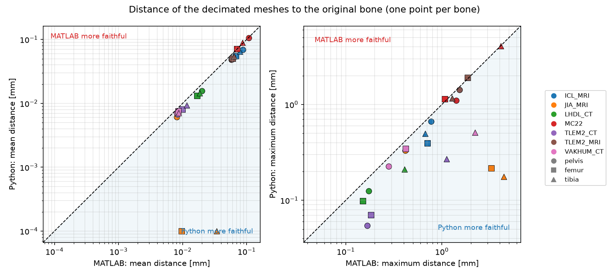

### Per dataset

Deviation maps (bones seen from the front and the back of STAPLE's anatomical frame): colour = largest distance of each triangle to the original bone surface (0-1 mm, purple above 1 mm). Histograms: distances in both directions between the decimated and the original surface.

#### ICL_MRI

| bone | faces (python / matlab / original) | mean py / ml [mm] | max py / ml [mm] |
|---|---|---|---|
| pelvis | 8954 / 8954 / 29850 | 0.069 / 0.087 | 0.66 / 0.77 |
| femur | 8820 / 8820 / 29400 | 0.055 / 0.068 | 0.40 / 0.71 |
| tibia | 7334 / 7334 / 24450 | 0.064 / 0.078 | 0.50 / 0.67 |

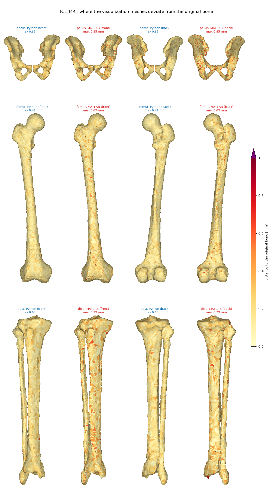

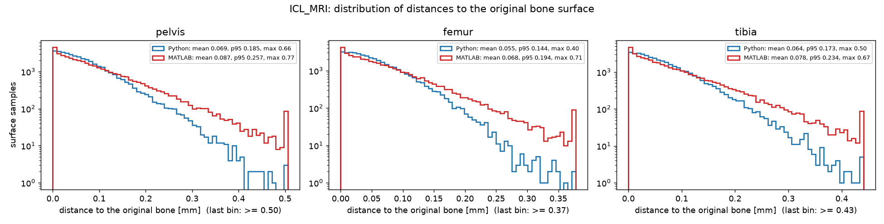

#### JIA_MRI

| bone | faces (python / matlab / original) | mean py / ml [mm] | max py / ml [mm] |
|---|---|---|---|
| pelvis | 79082 / 79082 / 263612 | 0.006 / 0.008 | 0.33 / 0.42 |
| femur | 45262 / 45262 / 150876 | 0.000 / 0.010 | 0.22 / 3.27 |
| tibia | 42530 / 42530 / 141772 | 0.000 / 0.034 | 0.18 / 4.40 |

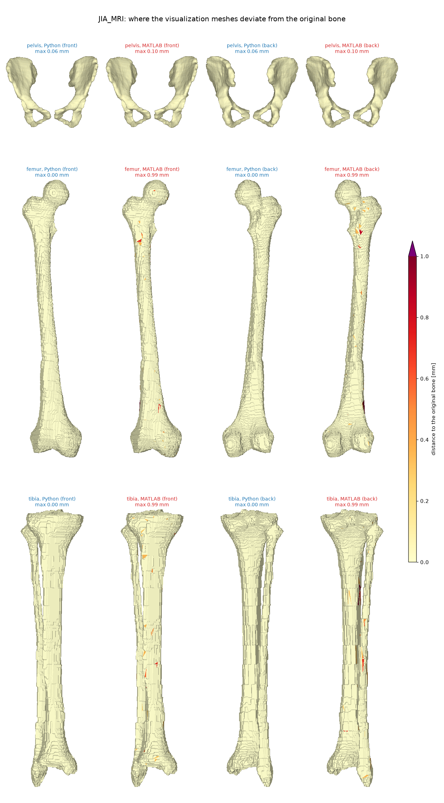

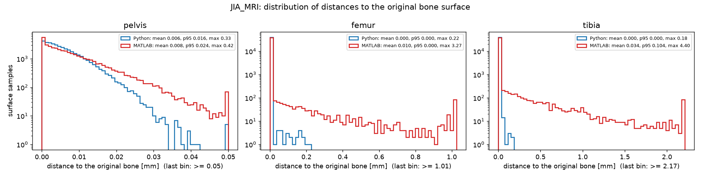

#### LHDL_CT

| bone | faces (python / matlab / original) | mean py / ml [mm] | max py / ml [mm] |
|---|---|---|---|
| pelvis | 28576 / 28576 / 95256 | 0.016 / 0.020 | 0.13 / 0.17 |
| femur | 21126 / 21126 / 70422 | 0.013 / 0.017 | 0.10 / 0.15 |
| tibia | 23254 / 23254 / 77514 | 0.014 / 0.019 | 0.21 / 0.41 |

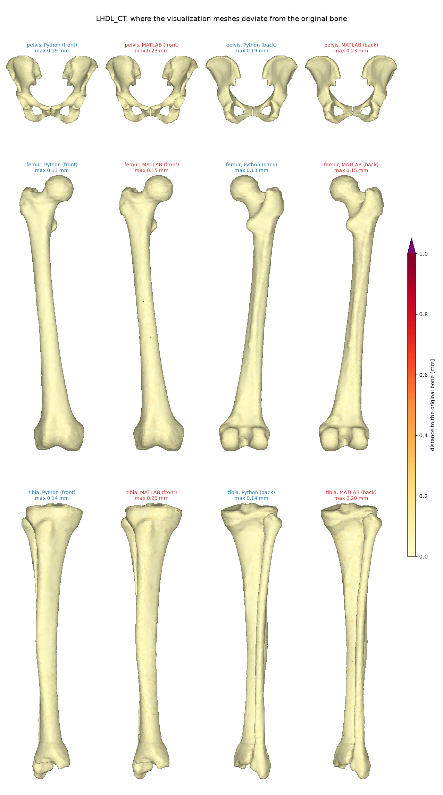

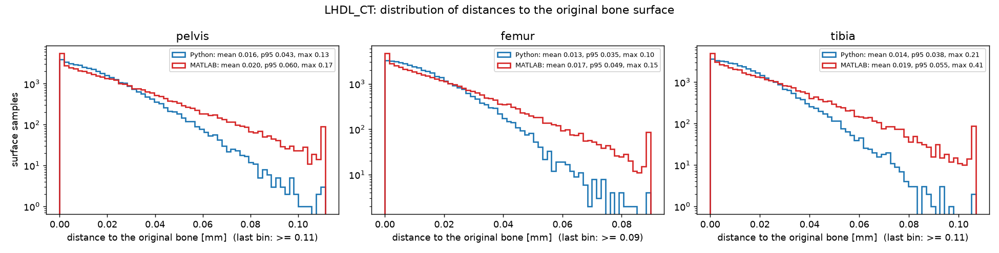

#### MC22

| bone | faces (python / matlab / original) | mean py / ml [mm] | max py / ml [mm] |
|---|---|---|---|
| pelvis | 18498 / 18498 / 61662 | 0.105 / 0.109 | 1.10 / 1.41 |
| femur | 10480 / 10480 / 34936 | 0.071 / 0.071 | 1.14 / 1.07 |
| tibia | 9210 / 9210 / 30706 | 0.089 / 0.087 | 4.08 / 4.10 |

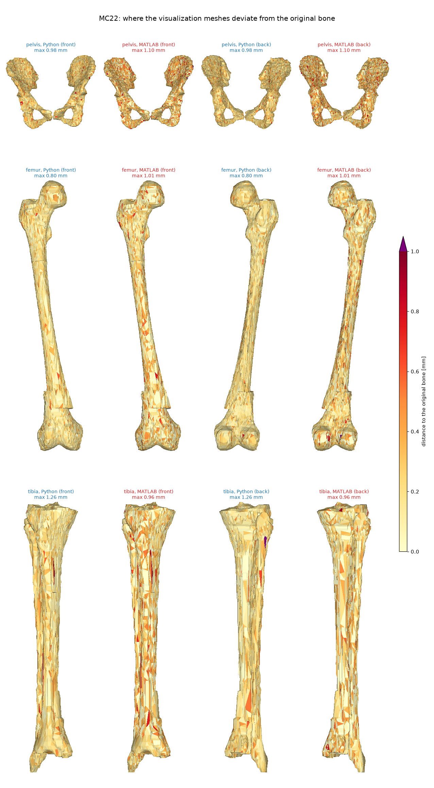

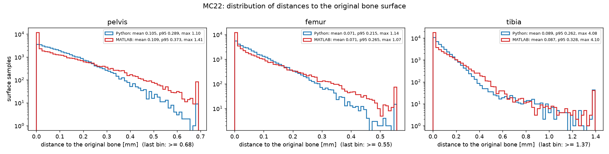

#### TLEM2_CT

| bone | faces (python / matlab / original) | mean py / ml [mm] | max py / ml [mm] |
|---|---|---|---|
| pelvis | 127970 / 127970 / 426568 | 0.007 / 0.008 | 0.05 / 0.17 |
| femur | 50580 / 50580 / 168604 | 0.008 / 0.010 | 0.07 / 0.18 |
| tibia | 35904 / 35904 / 119682 | 0.009 / 0.012 | 0.27 / 1.12 |

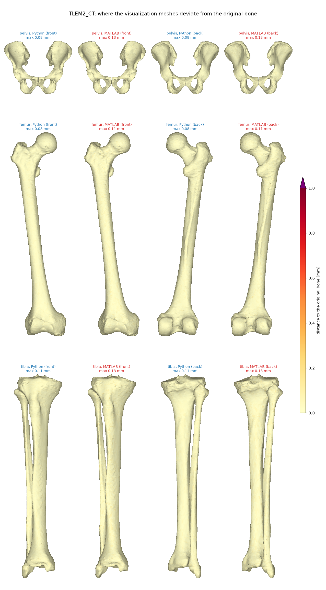

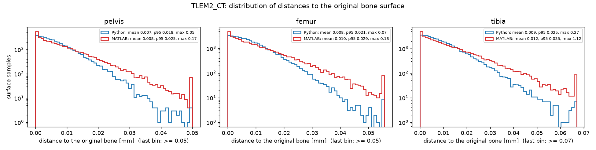

#### TLEM2_MRI

| bone | faces (python / matlab / original) | mean py / ml [mm] | max py / ml [mm] |
|---|---|---|---|
| pelvis | 22374 / 22374 / 74586 | 0.049 / 0.058 | 1.42 / 1.53 |
| femur | 9910 / 9910 / 33036 | 0.050 / 0.060 | 1.91 / 1.85 |
| tibia | 8728 / 8728 / 29098 | 0.054 / 0.063 | 1.16 / 1.28 |

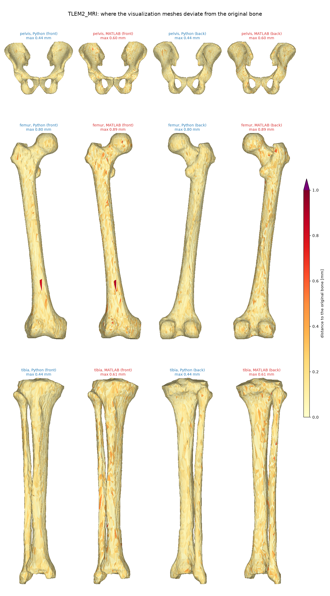

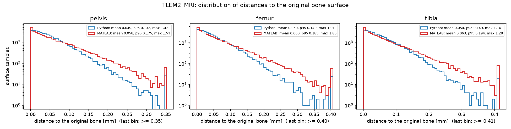

#### VAKHUM_CT

| bone | faces (python / matlab / original) | mean py / ml [mm] | max py / ml [mm] |
|---|---|---|---|
| pelvis | 137132 / 137132 / 457112 | 0.007 / 0.008 | 0.23 / 0.28 |
| femur | 50448 / 50448 / 168162 | 0.008 / 0.009 | 0.34 / 0.42 |
| tibia | 45644 / 45644 / 152152 | 0.007 / 0.009 | 0.51 / 2.21 |

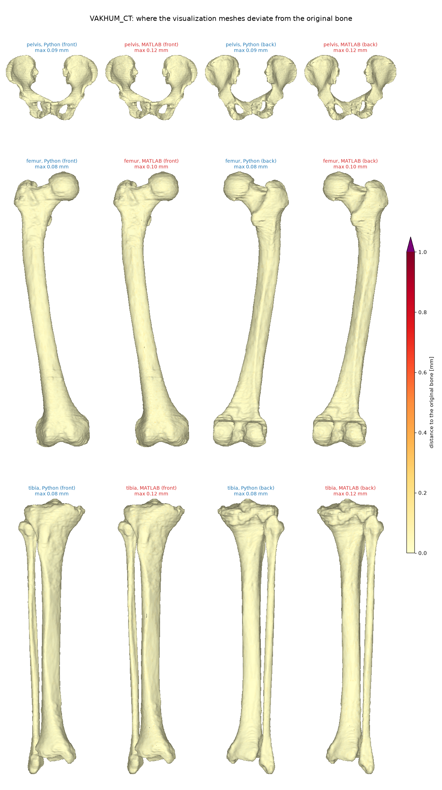

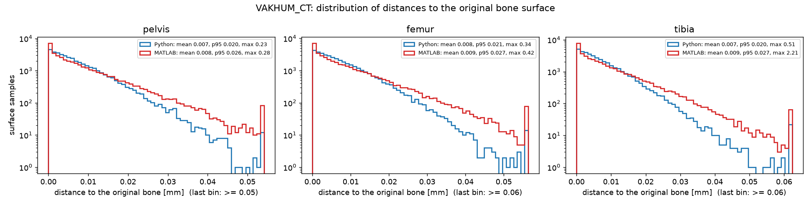
